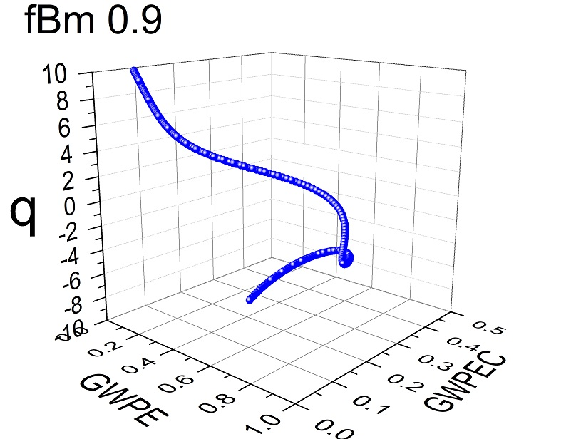

# Generalized Weighted Permutation Entropy

## Introduction
This code repository implements a novel heuristic approach for time series data analysis, dubbed [Generalized weighted permutation entropy](https://arxiv.org/abs/2207.01169), which amalgamates and generalizes beyond their original scope two well established data analysis methods: Permutation entropy, and Weighted permutation entropy. The method introduces a scaling parameter to discern the disorder and complexity of ordinal patterns with small and large fluctuations. Using this scaling parameter, the complexity-entropy causality plane is generalized to the complexity-entropy-scale causality box.

## Setup
The library is self-contained in the ```gwpentropy.h``` header with examples of integrations in ```C```, ```R```, and ```Python```, found in the respective directories. Below are instructions for running examples in each environment.
* ```C```: Run the Microsoft Visual Studio project.
* ```Python```: Run the following compilation  ```cd python && python setup build && cp build/lib/gwpe* .``` followed by the example ```python gwpe.py```
* ```R```: Install graphics package in R ```install.packages("scatterplot3d")``` and run the example ```Rscript gwpe.R```

## Library
The library exposes a single function that computes the generalized weighted permutation entropy. The API of that function is defined as follows and has similar arguments for the ```R``` and ```Python``` wrappers.
```
gwpentropy(double *H, double *C, double *buf, int n, int w, double q)
```
* ```H```: Scalar value for the entropy (output)
* ```C```: Scalar value for the complexity (output)
* ```Buf```: Series as a one-dimensional array (input)
* ```n```: Number of elements in the series (input)
* ```w```: Word size (input)
* ```q```: Scaling parameter (input)

## Results
Simulations are conducted on synthetic series generated by stochastic, chaotic, and random processes, as well as real world data, included under ```data/```. Below are shown unique signatures produced in this three dimensional representation using a word size of ```w=6```, results are also included under ```resultsw6/```.

| | | |
|:-------------------------:|:-------------------------:|:-------------------------:|
| | ||
| | ||
| | ||

## Citation
If you use this work in academic research, we would appreciate citations to the following reference:

```
@misc{stosic2022generalized,
title = {Generalized Weighted Permutation Entropy}, 
author = {Darko Stosic and Dusan Stosic and Tatijana Stosic and Borko Stosic},
year = {2022},
eprint = {2207.01169},
archivePrefix = {arXiv},
primaryClass = {cond-mat.stat-mech}
}
```

## Contact
Darko Stosic (ddstosic@bu.edu)
Dusan Stosic (dbstosic@bu.edu)
Tatijana Stosic (tastosic@gmail.com)
Borko Stosic (borkostosic@gmail.com)
